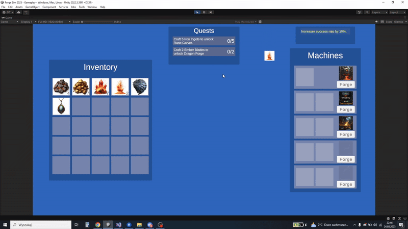

# Forge Sim 2025
### A small project created in one day as part of a recruitment process to showcase my programming skills.

#### Description:
- The project was built using a mix of design patterns. The Inventory system follows the **MVC** (Model-View-Controller) architecture and utilizes **Dependency Injection** via **Zenject**. Due to time constraints, other systems were implemented in a more straightforward, Unity-native way, without strict adherence to MVC.
- **DOTween** was used to create animations.
- **Zenject's built-in MemoryPool (Object Pooling)** was used to generate falling items in the **mini-game**, which allows players to collect new resources.
- The project was developed in **Unity 2022.3.39f1** using the **Universal Render Pipeline (URP)**.

  

